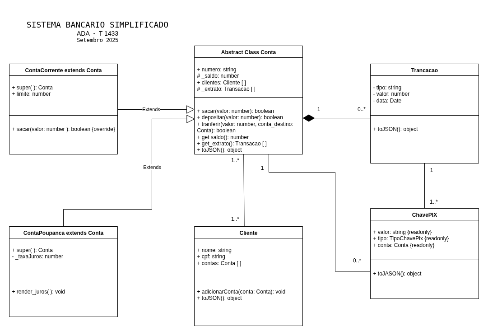

# Sistema Bancário Simplificado em TypeScript

Este projeto modela a lógica de um pequeno sistema bancário, implementado em TypeScript, com foco na aplicação dos princípios fundamentais da Programação Orientada a Objetos (POO) para garantir a segurança das transações e a integridade dos dados.

## Tecnologias Utilizadas

*   **TypeScript**: Superset do JavaScript que adiciona tipagem estática ao código.
*   **Node.js**: Ambiente de execução para o código no lado do servidor.
*   **ts-node**: Ferramenta para executar diretamente os arquivos TypeScript sem a necessidade de compilação prévia.

## Estrutura do Sistema (UML)

O diagrama UML a seguir ilustra as relações entre as principais classes do sistema, como `Cliente`, `Conta`, `ContaCorrente`, `ContaPoupanca` e `Transacao`.



## Pilares da POO Contemplados no Projeto

O sistema foi estruturado para demonstrar de forma prática os conceitos essenciais da Programação Orientada a Objetos.

### 1. Encapsulamento

A proteção dos dados é um requisito central. O atributo `saldo` da classe `Conta` é definido como `private`, impedindo o acesso e a modificação direta. A alteração do saldo só é permitida através de métodos públicos como `depositar(valor)` e `sacar(valor)`, que contêm as regras de negócio e validações necessárias (ex: verificar se o valor é positivo e se há saldo suficiente).

### 2. Herança

Para representar diferentes tipos de contas, foi utilizada herança. Uma classe abstrata `Conta` define a estrutura e os comportamentos comuns, enquanto as classes `ContaCorrente` e `ContaPoupanca` herdam dela e adicionam funcionalidades específicas:

*   **`ContaCorrente`**: Possui um `limite` de cheque especial.
*   **`ContaPoupanca`**: Possui um método `renderJuros()` para aplicar a taxa de rendimento.

### 3. Abstração

A classe `Conta` serve como uma abstração, definindo o "contrato" que uma conta bancária deve seguir, sem se preocupar com os detalhes de implementação de cada tipo específico. Isso simplifica a interação com os objetos, pois podemos tratar `ContaCorrente` e `ContaPoupanca` de forma genérica como uma `Conta`.

### 4. Polimorfismo

O polimorfismo é visível na capacidade de tratar objetos de classes filhas (`ContaCorrente`, `ContaPoupanca`) como se fossem objetos da classe mãe (`Conta`). Por exemplo, o método `transferir(valor, contaDestino)` pode receber qualquer tipo de conta como destino, pois espera um objeto do tipo `Conta`, e o comportamento do saque se adapta se a conta é corrente (usando limite) ou não.

## Outros Conceitos Aplicados

*   **Associação**: Um `Cliente` pode ter múltiplas `Contas` (relação 1-para-N).
*   **Composição**: Uma `Conta` é "composta" por seu histórico de `Transacoes`. O ciclo de vida das transações está atrelado ao da conta.
*   **Serialização**: As classes implementam um método `toJSON()` para controlar como os objetos são convertidos para o formato JSON, evitando a exposição de dados sensíveis.

## Como Executar

1.  **Pré-requisitos**: Certifique-se de ter o Node.js instalado em sua máquina.

2.  **Instalar dependências**: No diretório raiz do projeto, execute o comando para instalar os pacotes necessários:
    ```bash
    npm install
    ```

3.  **Executar a simulação**: Para rodar o script principal que simula as operações bancárias, utilize:
    ```bash
    npx ts-node src/index.ts
    ```
